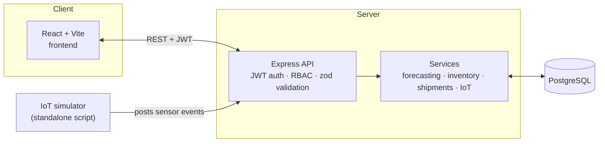

# SDCIP — Supply Chain Digital Intelligence Platform

A full-stack demand forecasting, inventory, and logistics platform for a
fictional consumer-electronics manufacturer ("SupplyNext"), built end-to-end
from a Software Requirements Specification: role-based dashboards, forecasting
with planner overrides, multi-warehouse inventory, and shipment/IoT tracking
with a device simulator.

Built it to practice the part of a real product build that's easy to skip in
portfolio projects — actual auth with per-route role authorization, a real
Postgres schema instead of mock arrays, tests, and CI — not just a UI over a
to-do list.

#URL: [https://supply-next.netlify.app/]

Node.js/TypeScript + Express + PostgreSQL on the backend, React + TypeScript +
Vite on the frontend.

[](https://github.com/<your-username>/sdcip/actions)


---

## Key features

**Demand forecasting** — trailing-mean model with confidence bands per SKU,
flags forecasts with high uncertainty, and lets planners override a forecast
with a mandatory documented reason (logged for future retraining).

**Multi-warehouse inventory** — live stock ledger across a factory and three
warehouses, auto-computed reorder points and safety stock derived from
forecast demand and lead time, over/understock detection with transfer
recommendations, and cycle-count reconciliation with automatic variance
flagging.

**Role-based dashboards** — six roles (Sales Planner, Production Manager,
Warehouse Manager, Logistics Coordinator, Executive, Admin), each seeing a
different KPI set computed live from the same underlying data, with
route-level authorization enforcing who can view or act on what.

**Logistics & IoT tracking** — shipment lifecycle (`pending → in_transit →
delivered/delayed`), an event log for RFID/GPS/condition sensor data, and an
included **device simulator** that posts realistic events against the live
API so the dashboard shows shipments actually moving and arriving in near
real time.

**Auth done properly** — JWT sessions, bcrypt-hashed passwords, per-route
role authorization (not just hidden UI buttons), and rate limiting on login.

## Tech stack

| Layer | Choices |
|---|---|
| Backend | Node.js, TypeScript, Express, raw SQL via `pg` (no ORM) |
| Database | PostgreSQL |
| Frontend | React, TypeScript, Vite, Recharts |
| Auth | JWT (`jsonwebtoken`), `bcryptjs`, `zod` request validation, `express-rate-limit` |
| Testing | Vitest + Supertest, 16 tests (unit + integration) against a real Postgres test DB |
| CI/CD | GitHub Actions (typecheck, build, test on every push) |

## Architecture



## Running it locally

**Prerequisites:** Node.js 18+, PostgreSQL

```bash
# 1. Database
sudo apt-get install postgresql
sudo service postgresql start
sudo -u postgres psql -c "CREATE USER sdcip WITH PASSWORD 'sdcip_dev_pw' CREATEDB;"
sudo -u postgres psql -c "CREATE DATABASE sdcip OWNER sdcip;"

# 2. Backend  (terminal 1)
cd backend
cp -n .env.example .env   # -n: won't clobber an existing .env
npm install
npm run dev                # http://localhost:4000 — migrates + seeds automatically

# 3. Frontend  (terminal 2)
cd frontend
npm install
npm run dev                # http://localhost:5173

# 4. (optional) IoT simulator, so the Logistics tab shows live movement  (terminal 3)
cd backend
npm run simulate
```

Log in with any seeded account — password is the same for all of them:

| Email | Role |
|---|---|
| `tanvir.ahmed@supplynext.com` | Executive |
| `nusrat.jahan@supplynext.com` | Sales & Demand Planner |
| `kamrul.hasan@supplynext.com` | Production Manager |
| `farzana.akter@supplynext.com` | Warehouse Manager |
| `rafiqul.islam@supplynext.com` | Logistics Coordinator |
| `admin@supplynext.com` | Admin |

Password: `SDCIP-Pilot-2026`

## Testing & CI

```bash
cd backend
sudo -u postgres psql -c "CREATE DATABASE sdcip_test OWNER sdcip;"   # once
npm test
```

16 tests against a real (isolated) Postgres instance: unit tests on the
forecasting math, plus integration tests through the actual HTTP layer
covering login, request validation, and role-based authorization (e.g.
asserting a warehouse manager gets a 403 trying to override a forecast, and a
planner gets a 403 trying to reconcile stock). GitHub Actions runs the same
suite, with a Postgres service container, on every push.

## Deployed at

- **Frontend:** _Netlify
- **Backend API:** _Render
- **Database:** _Neon (PostgreSQL)_

## Project structure

```
.
├── backend
│   ├── src
│   │   ├── data
│   │   ├── db
│   │   ├── middleware
│   │   ├── routes
│   │   ├── scripts
│   │   ├── services
│   │   └── types
│   └── tests
│       ├── integration
│       └── unit
└── frontend
    ├── public
    └── src
        ├── api
        ├── assets
        ├── components
        ├── pages
        └── types
```

---
